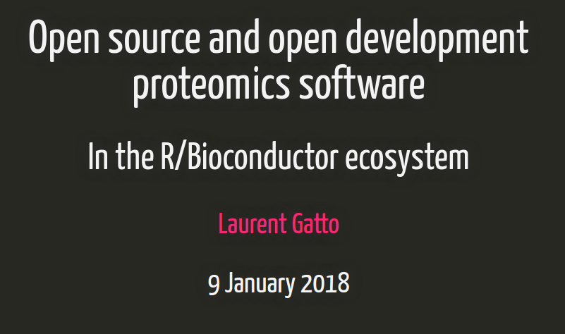

This repository contains the material for my keynote talk at
the [EuBIC 2018 meeting](http://uahost.uantwerpen.be/eubic18/).

## Open source and open development proteomics software 

### Abstract

Developing good scientific is difficult in many ways, considering that
it often relies on diverse skills (such as programming and scientific)
and needs to appeal to a broad audience (users and developers,
computational and experimentalists), features that are often difficult
to combine. In my talk, I would like to present a set of Bioconductor
software for mass spectrometry and proteomics I directly develop or
contribute to. I will briefly describe the software and some
interesting technical characteristics, and mention features that I
believe are important for good scientific software. I will also show
how some of these software packages evolved over time, greatly
benefited from external contributions, and how they fit into a broader
software ecosystem.

Slides are available [here](https://rawgit.com/lgatto/2018_01_09_EuBIC_Ghent/master/eubic_lgatto.html).

### Licence

All material is available under a creative common
[CC-BY license](http://creativecommons.org/licenses/by/4.0/). You are
free to share (copy and redistribute the material in any medium or
format) and adapt (remix, transform, and build upon the material) for
any purpose, even commercially.

