class: middle
name: cc-by


```{r setup, include=FALSE, message=FALSE}
options(htmltools.dir.version = FALSE)
library("BiocStyle")
library("ggplot2")
library("magrittr")
library("dplyr")
library("knitr")
library("lubridate")
library("gridExtra")
load("./data/downloads.rda")
```

### Get the slides at http://bit.ly/20180109eubic

These slides are available under a **creative common
[CC-BY license](http://creativecommons.org/licenses/by/4.0/)**. You are
free to share (copy and redistribute the material in any medium or
format) and adapt (remix, transform, and build upon the material) for
any purpose, even commercially
.

---
class: middle

### Abstract

Developing good scientific is difficult in many ways, considering that
it often relies on diverse skills (such as programming and scientific)
and needs to appeal to a broad audience (users and developers,
computational and experimentalists), features that are often difficult
to combine. In my talk, I would like to present a set of
**Bioconductor software** for mass spectrometry and proteomics I
directly develop or contribute to. I will briefly **describe the
software** and some interesting **technical characteristics**, and
mention **features** that I believe are important for **good
scientific software**. I will also show how some of these software
packages **evolved over time**, greatly benefited from **external
contributions**, and how they fit into a **broader software
ecosystem**.


---
class: inverse, middle, center
count: false

# Bioconductor software

???

- What is Bioconductor? What is available in Bioconductor?
- How does the mass spectrometry and proteomics work I am involved in
  fits in the wider project.
- Because open source and open development shoudn't be done in
  glorious isolation, or at least that isn't when openness shines.


---
class: middle 

[Bioconductor](https://bioconductor.org/) provides tools for the
analysis and comprehension of high-throughput genomic
data. Bioconductor uses
the [R statistical programming language](https://www.r-project.org/),
and is **open source** and **open development**.  Currently, in
release 3.6, there
are
[1476 software](https://bioconductor.org/packages/release/BiocViews.html#___Software) (908
annotation and 325 experiment) packages, and an active user community.

--

Open source, and **coordinated open development**, enabling
**reproducible research** enables understanding of the data (not a
black box) and **drive scientific innovation**.

- Bioconductor core team (lead by Dr. Martin Morgan)
- Common infrastructure
- Common documentation standards
- Common testing infrastructure
- Open package technical peer review
  ([publicly, on GitHub](https://github.com/Bioconductor/Contributions))

???

- Open source: GPL, Artistic, MIT licenses, ...
- More importantly though, open development, i.e. accepting
  contributions from the community in forms of packages, of course,
  but also ideas and contributions to packages.
- I will give more examples later.

--

Since 2010 - 2011, there has been a considerable increase in the
number and usage of mass spectrometry and proteomics software in
Bioconductor (see the [Proteomics packages in
Bioconductor](https://lgatto.github.io/RforProteomics/articles/biocprot.html)
for details.)


---
class: middle, center

<a href="https://twitter.com/mikelove/status/950461433388654592?ref_src=twsrc%5Etfw">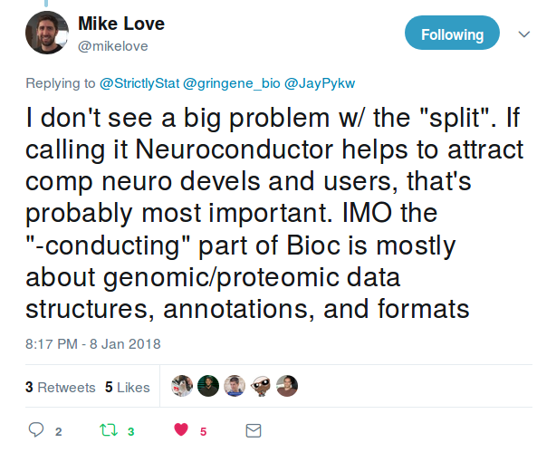</a>

???

Coincidently, Mike Love, the main developer
of
[`DESeq2`](https://bioconductor.org/packages/release/bioc/html/DESeq2.html) posted
this on twitter last night, and I was very happy that he was inclusive
of proteomics.

---
class: middle, center

```{r nbpkgs, echo=FALSE}
nbp <- pyearly %>% group_by(Year) %>% count()
ggplot(nbp, aes(x = Year, y = n, group = 1)) +
    geom_line() + geom_point() +
    ylab("Number of packages")
```

???

These are data for version 3.7, the current devel version.

In 2011 and in the years thereafter, the Bioconductor project has
accepted a growing number of proteomics packages. Since 2009, there
were 14, 15, 22, 32, 52, 69, 82, 89, 97 and 96 packages, corresponding
to 1, 7, 10, 20, 17, 13, 7, 8 and -1 new packages per year.

---
class: middle, center

### Downloads (distince IPs)

```{r nnbdown, echo=FALSE, fig.width=12}
mzrsel <- pyearly$package == "mzR"
pyearly[mzrsel & pyearly$Year == 2013, "Nb_of_distinct_IPs"] <- 5000
pyearly[mzrsel & pyearly$Year == 2014, "Nb_of_distinct_IPs"] <- 7500
alldwn <- pyearly %>%
    filter(Year < as.numeric(format(Sys.time(),"%Y"))) %>%
    group_by(Year) %>%
    summarise(Downloads = sum(Nb_of_distinct_IPs))
p1 <- ggplot(alldwn, aes(x = Year, y = Downloads)) +
    geom_point() + geom_line() +
    ylab("Total number of downloads (distinct IPs)")    
p2 <- ggplot(pyearly, aes(x = Date, y = Nb_of_distinct_IPs, group = package)) +
    geom_point() + geom_line() + 
    ylab("Package downloads (distinct IPs)")
grid.arrange(p1, p2, ncol = 2)
```


---
class: middle, center

```{r toppkgs, echo=FALSE}
pyearly %>% filter(Year == 2017) %>%
    select(Year, Nb_of_distinct_IPs, Nb_of_downloads, package) %>%
    arrange(desc(Nb_of_distinct_IPs)) %>%
    head %>% kable
```

---
class: middle, center

```{r, echo = FALSE, fig.width = 12}
pkg <- "MSnbase"
dwndata <- pmonthly
x <- dwndata %>% filter(package == pkg)
p1 <- ggplot(x, aes(x = Date, y = Nb_of_distinct_IPs)) +
    geom_line(aes(colour = factor(Year))) +
    ylab("MSnbase downloads (distinct IPs)") +
    theme(legend.position="none")
p2 <- ggplot(x, aes(x = month(Date),
                    y = Nb_of_distinct_IPs,
                    group = Year)) +
    geom_line(aes(colour = factor(Year))) +
    ylab("MSnbase downloads (distinct IPs)")    
grid.arrange(p1, p2, ncol = 2)
```

---
class: inverse, middle, center
count: false

# Use cases

### Dependencies
### Data structures
### Applications

---
class: middle, center

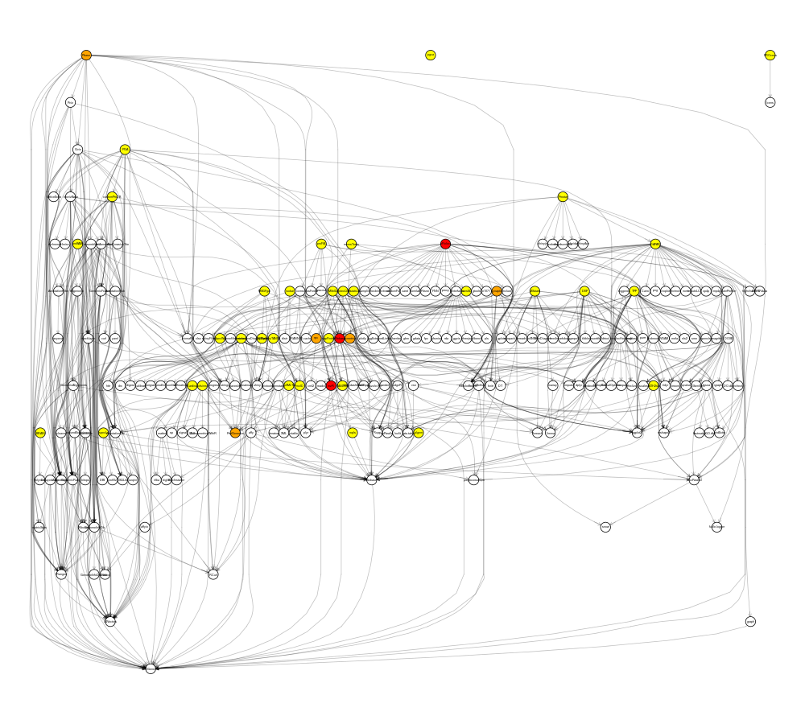


???

Dependency graph containing 41 MS and proteomics-tagged packages (out
of 100+) and their dependencies. Showing all packages and deps would
produce a big hairball.

- Number of proteomics packages: 97
- Number of mass spec packages: 66
- 41 in common, coloured on the graph
- 192 white nodes, non-MS/prot dependencies
- My Bioc packages: 16, 8 on that graph


---
class: middle, center

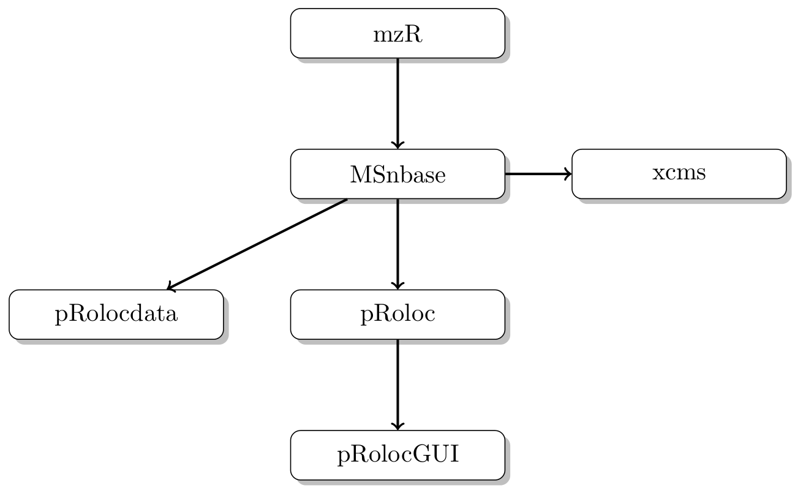

???

Explain what these different packages do.

- `mzR`: fast access to raw MS data in open formats
- `MSnbase`: general infrastructure of MS and proteomics
- `pRoloc`: suite of software for spatial proteomics


---
class: middle, center, inverse
count: false

## Data infrastructure

---
class: middle

## Data infrastructure

The availability of core data infrastructure that is used across
packages is an essential aspect to Bioconductor and its
success. Package developers are advised to make use of existing
infrastructure to provide coherence, interoperability and stability to
the project as a whole.

Below are some core classes, taken from the
[Common Bioconductor Methods and Classes](https://bioconductor.org/developers/how-to/commonMethodsAndClasses/) page.

???

- Common data infrastructure limits to re-invent the wheel over and
  over again.
- Allows users to easily learn and use new software, as same
  structures and **concepts** are applied in different places.

---
class: middle

#### Importing

- GTF, GFF, BED, BigWig, etc., - `r Biocpkg("rtracklayer")``::import()`
- VCF – `r Biocpkg("VariantAnnotation")``::readVcf()`
- SAM / BAM – `r Biocpkg("Rsamtools")``::scanBam()`, `r Biocpkg("GenomicAlignments")``:readGAlignment*()`
- FASTA – `r Biocpkg("Biostrings")``::readDNAStringSet()`
- FASTQ – `r Biocpkg("ShortRead")``::readFastq()`
- Mass spectrometry data (XML-based and mfg formats) – `r Biocpkg("MSnbase")``::readMSData()` (see later), `r Biocpkg("MSnbase")``::readMgfData()`

---
class: middle

#### Common Classes

- Rectangular feature x sample data – `r Biocpkg("SummarizedExperiment")``::SummarizedExperiment()` (RNAseq count matrix, microarray, ...)
- Genomic coordinates – `r Biocpkg("GenomicRanges")``::GRanges()` (1-based, closed interval)
- DNA / RNA / AA sequences – `r Biocpkg("Biostrings")``::*StringSet()`
- Gene sets – `r Biocpkg("GSEABase")``::GeneSet()` `r Biocpkg("GSEABase")``::GeneSetCollection()`
- Multi-omics data – `r Biocpkg("MultiAssayExperiment")``::MultiAssayExperiment()`
- Single cell data – `r Biocpkg("SingleCellExperiment")``::SingleCellExperiment()`
- Mass spectrometry data – `r Biocpkg("MSnbase")``::MSnExp()` (see later)
- Quantitative proteomics data – `r Biocpkg("MSnbase")``::MSnSet()` (see later)

---
class: middle, center

## Quantitative data: `MSnSet` in `MSnbase`


???

A common design theme that is found throughout many Bioconductor core
classes is illustrated below, which is found in microarrays,
quantiative proteomics data, RNA-Seq data, ... It contains a
rectangular *feature* by *sample* data matrix and sample and
feature-specific *annotations*.


---
class: middle

## Class structures and hierarchy 

- Low level raw data: `mzRpwiz`, `mzRnetCDF`, `mzRident`, ... in **`mzR`**
- High level raw data : `[OnDisk]MSnExp` in **`MSnbase`** (relying on **`mzR`**)

```{r msnbase, eval=FALSE}
library("MSnbase")
library("msdata")
basename(f <- msdata::proteomics(full.names = TRUE, pattern = "MS3"))
(x <- readMSData(f, mode = "onDisk"))
```

---
class: middle, center, inverse
count: false

## Applications (1)

### Spatial proteomics

---
class: middle

See *A Bioconductor workflow for processing and analysing spatial
proteomics data*
([doi:10.12688/f1000research.10411.1](https://f1000research.com/articles/5-2926/))
for details.


.left-col-40[
```{r spatprot, eval=FALSE}
library("pRoloc")
library("pRolocdata")
data(hyperLOPIT2015)
plot2D(hyperLOPIT2015)
```
]

.right-col-60[
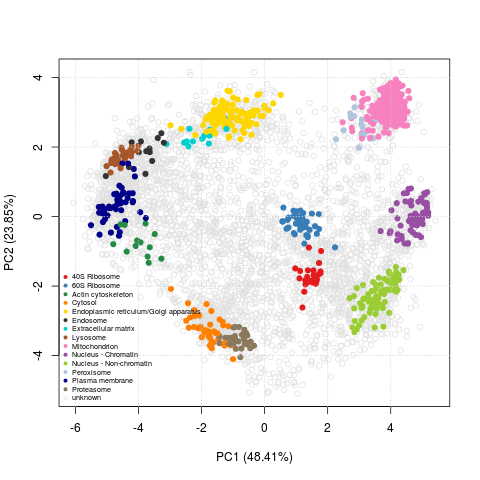
]


---
class: middle, center


???

The availability of **stable data structures**, **test data** spanning
over a decade, **good visualisation**, and **user input**, has enabled
new developments, new algorithms: **scientific innovation**.

---
class: middle, center, inverse
count: false

## Applications (2)

###  MS-based proteomics and metabolomics

---
class: middle


???

- Common fast and on-disk infrastructure for proteomics and
  metabolomics
- Better support for chromatograms in `MSnbase` and `xcms`


And while `xcms` and `pRolocdata` are miles away in terms of audience,
users, applications, from a software development perspective, they
have grown a shared root infrastructure.

---
class: inverse, middle, center
count: false


# Scientific software

### Documentations
### Testing
### Software decay

---

## Documentations

```{r, eval=FALSE}
> ?readMSData
> vignette(package = "MSnbase")
Vignettes in package ‘MSnbase’:

MSnbase-development     A short introduction to `MSnbase` development
                        (source, html)
MSnbase-demo            Base Functions and Classes for MS-based
                        Proteomics (source, html)
benchmarking            MSnbase2 benchmarking (source, html)
MSnbase-io              MSnbase IO capabilities (source, html)
```

Example at https://lgatto.github.io/MSnbase/

---

## Unit and integration testing

```
MSnbase
├── DESCRIPTION
├── NAMESPACE
├── NEWS
├── data
├── inst
│   ├── extdata
│   └── scripts
├── man
├── R
├── src
├── tests
│   └── testthat
└── vignettes
```


---
class: middle, center

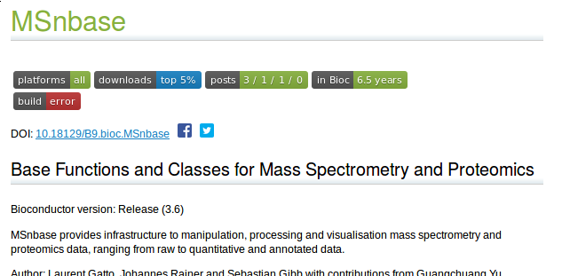


---
class: middle, center

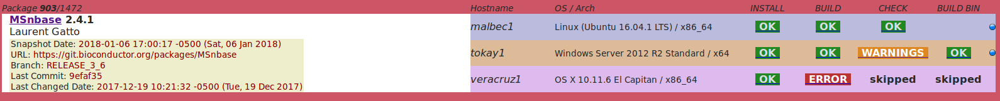


---

## Code coverage

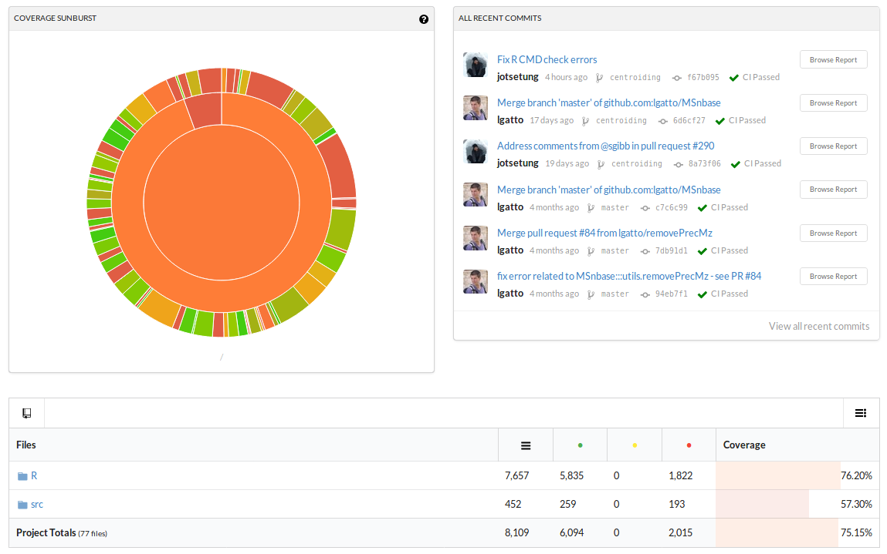

???

**Unit testing**, **proper documentation**, and more generally **good
research software development practices** such as **version control**
(Bioconductor has always has a subversion server, and has recently
moved to git, and seamingly integrates with popular platforms such as
GitHub or Bitbucket) and important, and this is increasingly
appreciated in some circles.

**But, it is also an important tool against software decay**

---
class: middle, center

## The cost of maintenance vs. software decay

<a href="https://lgatto.github.io/my-r-packages/">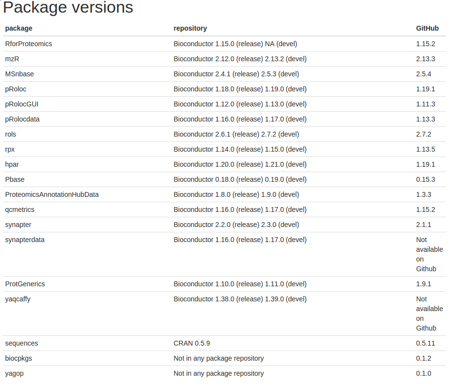</a>


???

Here is the (complete, I believe) list of the R packages I maintain or
co-maintain. They are not as large, (relatively) widely used or relied
upon as `mzR` or `MSnbase`, but maintenance is **a lot** of work!

---
class: middle

## The cost of maintenance vs. software decay

- Software decay.
- Additional maintenace due to of dependencies, especially online
  resources (for example `r Biocpkg("rols")` and `r Biocpkg("rpx")`).
- Testing helps with maintenance.
- (In the long run) sometimes, less (code, features - think
  of [feature creep](https://en.wikipedia.org/wiki/Feature_creep)) is
  more (better maintenance).
- [Deprecation](https://bioconductor.org/developers/package-end-of-life/) vs. long term maintenace (and funding!).

???

It is relatively easy to write code and software, and as
bioinformaticians/computational biologists, it's certainly something
we like doing, but ...

---
class: middle, center

<a href="https://twitter.com/ChrisFiloG/status/950412667013009408">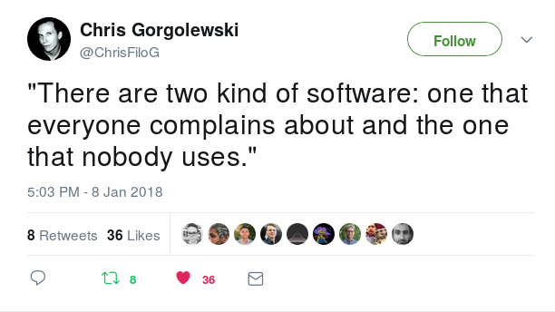</a>

---
class: inverse, middle, center
count: false

# `MSnbase` contributions

---
class: middle, center

<a href="https://github.com/lgatto/MSnbase/graphs/contributors">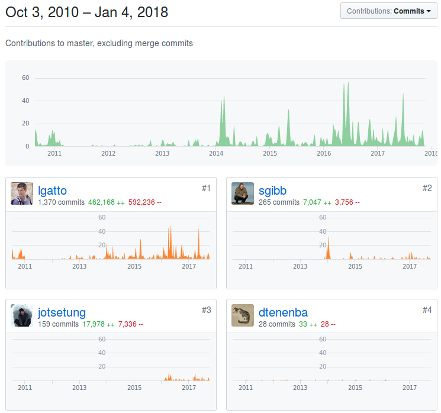</a>

---
class: middle, center

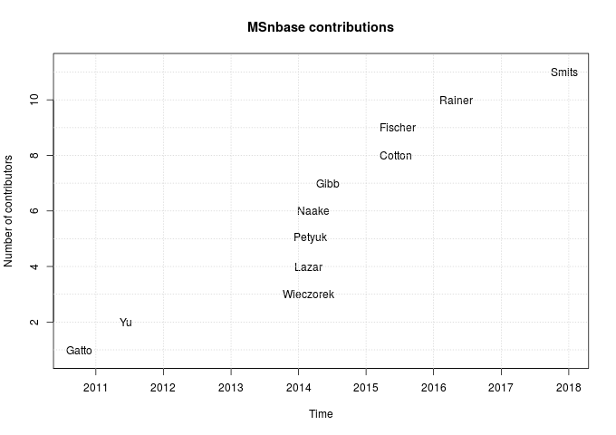

.left[See also [this blog post](https://lgatto.github.io/msnbase-contribs/).]


---
class: middle

## More information

- The [Bioconductor](http://www.bioconductor.org) web site.
- The `r BiocStyle::Biocexptpkg("RforProteomics")` package and
  references therein.
- The [Navigating the Bioconductor project]( https://lgatto.github.io/2017_11_09_Rcourse_Jena/) chapter
  of a recent course: vignettes, workflows, biocViews, ...
- [Teaching material](https://lgatto.github.io/TeachingMaterial/) and [here](https://rawgit.com/lgatto/bioc-ms-prot/master/lab.html).


---
class: middle
name: laurent-gatto

.left-col-50[

### Laurent Gatto
<i class="fas fa-flask"></i>&nbsp;[Computational Proteomics Unit](https://lgatto.github.io/cpu-lab/)<br />
<i class="fas fa-map-marker-alt"></i>&nbsp;University of Cambridge<br />
<i class="fas fa-envelope"></i>&nbsp;lg390@cam.ac.uk<br />
<i class="fas fa-home"></i>&nbsp;https://lgatto.github.io<br />
<i class="fab fa-twitter"></i>&nbsp;[@lgatto](https://twitter.com/lgatt0/)<br />
<i class="fab fa-github"></i>&nbsp;[lgatto](https://github.com/lgatto/)<br />
&nbsp;[0000-0002-1520-2268](https://orcid.org/0000-0002-1520-2268)<br />
&nbsp;[lgatto](https://keybase.io/lgatto)<br />
&nbsp;[Google scholar](https://scholar.google.co.uk/citations?user=k5DrB74AAAAJ&hl=en)<br />
&nbsp;[Impact story](https://profiles.impactstory.org/u/0000-0002-1520-2268)<br />
<i class="fas fa-pencil-alt"></i>&nbsp;[dissem.in](https://dissem.in/r/6231/laurent-gatto)<br />
<!-- <i class="fab fa-linkedin"></i>&nbsp;https://www.linkedin.com/in/lgatto/<br /> -->
]

.rigth-col-50[

**Acknowledgements**: funders that support good research software (in
my base, [BBSRC](http://www.bbsrc.ac.uk/) and
the [Wellcome Trust](https://wellcome.ac.uk/)
via [Kathryn Lilley](https://www.bioc.cam.ac.uk/people/uto/lilley)),
as well as users and contributors (in particular
[Lisa Breckels](https://github.com/lmsimp/),
[Sebastian Gibb](https://sgibb.github.io/)
and [Johannes Rainer](https://github.com/jotsetung/))

## Thank you for your attention

### Find the slides at [http://bit.ly/20180109eubic](https://rawgit.com/lgatto/slide-templates/master/my_template.html)
]

